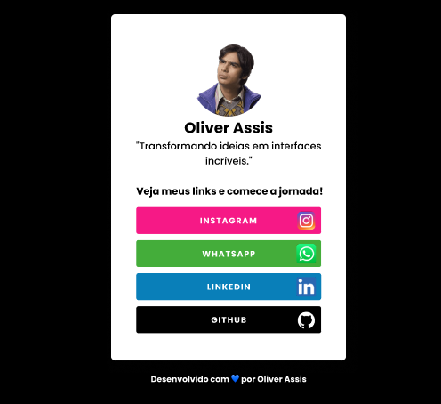

# 💼 Cartão de Apresentação Digital

## 📋 Descrição

Este projeto é um **Cartão de Apresentação Digital** desenvolvido exclusivamente com **HTML** e **CSS**. Ele visa criar uma página simples, responsiva e elegante para que profissionais possam apresentar suas informações de forma prática e moderna.

O objetivo principal deste projeto foi aplicar os conceitos fundamentais de HTML e CSS, criando um layout responsivo e atraente, adequado para **celulares, tablets e desktops**.

## 🚀 Funcionalidades

- **Imagem de Perfil** (Avatar) centralizada.
- **Nome Completo** e **Profissão** destacados.
- **Breve Descrição** sobre o profissional.
- **Links para Redes Sociais** ícones clicáveis, direcionando para as redes sociais.
- **Design Responsivo** para diferentes dispositivos.
- **Efeitos de Hover** nos ícones de redes sociais.
- **Estilo Clean e Minimalista** com foco nas informações principais.

## 🛠 Tecnologias Utilizadas

- **HTML**: Estruturação do conteúdo da página.
- **CSS**: Estilização do cartão e definição do layout.
- **Flexbox**: Para criar o layout flexível e alinhamento adequado dos elementos.
- **Media Queries**: Garantir a adaptabilidade da página para diferentes tamanhos de tela.

## 💻 Como Rodar o Projeto

1. **Clone o repositório**:
    ```bash
    git clone https://github.com/oliverassis00/oliver-links.git
    ```
2. **Abra o arquivo** `index.html` no seu navegador para visualizar o cartão de apresentação.

## 🌐 Visualização

Veja abaixo uma captura de como o cartão de apresentação pode se parecer:



## ✨ Melhorias Possíveis

- Integrar o projeto com um formulário de contato.

## 📜 Licença

Este projeto está licenciado sob a **MIT License**.

